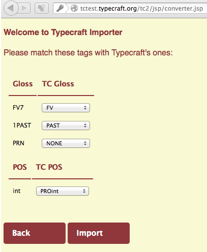

Conversion of file format on the command line
*********************************************

From the user's perspective the conversion of file formats with mapping of annotations (within or across tiers) consists of three steps:

* Generate an empty mapping file. This file will contain all annotation labels that could not be mapped to the output file format. The mapping file is a JSON file.
* Edit the JSON file and add missing output annotation labels.
* Run the conversion with the mapping file as additional input.

We will demonstrate the three steps with an example conversion from Toolbox to Typecraft. Typecraft has a fixed set of annotations that we can use, while most Toolbox files use a variety of tag sets. This makes Toolbox to Typecraft conversion examplary use case, because in most cases the user has to define a mapping so that she can import her files into the Typecraft web application. The general mechanism is of course applicable to other conversion workflows as well.

Conversion on the command line
------------------------------

To convert a file on the command the Poio API source contains a script `poio_converter.py` in the `examples` folder. To convert a file, you have to specify the input file and the output file and the type of both files (for example `toolbox` and `typecraft`). To convert a file from the Toolbox format to the Typecraft XML format you call the script like this:

.. code-block:: sh
  
  $ python poio_converter.py -i toolbox -o typecraft toolboxfile.txt typecraftfile.xml

Any annotations that are not part of the Typecraft tagset will be left empty in the output file, as we cannot import the XML into Typecraft if there is any annotation that does not belong to the tagset.

The JSON mapping file
---------------------

To map annotation from your Toolbox tagset to the Typecraft tagset you have to create a special mapping JSON file first. This is done with the `-m` option of the converter script:

$ python poio_converter.py -m -i toolbox -o typecraft toolboxfile.txt typecraft_mapping.json

This will generate a file `typecraft_mapping.json` in the current folder. The content of the file might look like this:

.. code-block:: json

  {
          "gloss": {
          "1PAST": "",
              "FV7": "",
          "PRN": ""
      },
          "part of speech": {
          "int": ""
      }
  }

The JSON structure consists of two block for `gloss` and `part of speech` tags in this case. The right hand sind of each tag is an empty string. You have to fill in the Typecraft tags that you want to map to for each of your Toolbox tags. For example:

.. code-block:: json

  {
      "gloss": {
              "1PAST": "PAST",
          "FV7": "FV",
              "PRN": ""
      },
      "part of speech": {
              "int": "PROint"
      }
  }

If you don’t want to map one of the tags then you can just leave the right hand side empty, as in the example above for the Toolbox tag "PRN". You can now pass the JSON mapping file to the converter via the `-t` option when you run the full conversion:

.. code-block:: sh

  $ python poio_converter.py -m -i toolbox -o typecraft -t typecraft_mapping.json toolboxfile.txt typecraftfile.xml

In some cases you might want to map a tag to another tier, for example from the "gloss" tier to the "part of speech" tier. To map between tiers you have to specify the tier name on the right hand side of the mapping. Just use a list and put the output tier name as the first element in the list. For example, to map the "PRN" tag from Toolbox to the “part of speech” tier of Typecraft:

.. code-block:: json

  "PRN": [ "part of speech", "PN"]

Tier names of the input file
----------------------------

Poio API specifies default tier names for each input file format. For example, in the case of toolbox the tier names of the "gloss" tier might be "ge" or "g". Those names are defined in the Toolbox software and might be changed by the user. If your gloss names are different from the default names in Poio API you can define new tier names by adding a `tier_names` map to the JSON mapping file. To use an additional gloss tier name “gloss” you can start the JSON file with:

.. code-block:: json

  {
      "tier_mapping": {
          "gloss": [
                  "ge",
                  "g",
          "gloss"
              ],
      },
          "gloss": {
      [ ... rest of the file as above ... ]

More examples of JSON mapping files
-----------------------------------

More examples of JSON mapping files can be found in the Poio API repository. We already defined two default mappings for corpora from different sources. One is the default mapping for Toolbox files:

https://github.com/cidles/poio-api/blob/master/src/poioapi/mappings/TOOLBOX_TYPECRAFT.json

The other mapping is used for data from certain Word files that contain interlinear glossed text and is just referenced here as an example:

https://github.com/cidles/poio-api/blob/master/src/poioapi/mappings/MANDINKA_TYPECRAFT.json

Map programmatically in Python
------------------------------

You can also use Poio API directly from Python to generate and apply a JSON mapping file when you convert from one file format to another. Please also check the `poio_converter.py` script for example code.

The basic idea is that each Writer class in Poio API is responsible to check for and convert from tags that are part of the file format of that Writer class. For this, each writer can provide a method missing_tags() that will write a JSON mapping file. The following code parses a Toolbox file into a GrAF annotation graph, creates a Typecraft writer and calls missing_tags() with the output file name and the annotation graph as arguments:

.. code-block:: python

  from poioapi.annotationgraph import AnnotationGraph
  import poioapi.io.typecraft

  ag = AnnotationGraph.from_toolbox("toolboxfile.txt")
      typecraft = poioapi.io.typecraft.Writer()
       typecraft.missing_tags("maping.json", ag)

To apply the mapping file when writing the file you pass an additional argument extra_tag_map to the write() method of the writer:

.. code-block:: python

  typecraft.write("typecraftfile.xml", ag,
      extra_tag_map="mapping.json", language="your_iso_code")

Internals: The mapping classes
------------------------------

The TierMapper class
....................

To generalize conversion and annotation mapping in Poio API we define a fixed set of tier types. Each of the tier types has then one or more names in each specific file format. This allows the conversion to work with the fixed set of tier types, the converter does not have to handle all the different tier names that might be used in the different file formats. The class poioapi.mapper.TierMapper is responsible for the mapping between tier types and tier names. A tier type might be linked to an ISOcat category, as soon as there is an agreement about tier types within the linguistic community.

To support the files formats and corpora that we encountered so far we defined the following tier types in Poio API:

* utterance
* word
* morpheme
* part of speech
* gloss
* graid1
* graid2
* translation
* comment

This list might look kind of ad hoc, and in fact it is the result of the use cases we had so far. If there is any requirement for new tier types we can easily add new types to this list. Compare the tier types that we listed here to the names in the JSON mapping files: the `tier_names` dictionary uses exactly these tier types as keys. In fact, we add any user defined tier names from the JSON files to the TierMapper object that we use during conversion.

Beside the user defined tier names there is a set of default tier names for each file format. In the case of Toolbox we pre-defined the following tier names in the module poioapi.io.toolbox: 

* utterance: utterance_gen
* word: tx, t
* morpheme: mb, m
* part of speech: ps, p
* gloss: ge, g
* translation: ft, f
* comment: nt

The user can easily add and modify this list via JSON mapping files, as described above.

The AnnotationMapper class
..........................

The AnnotationMapper is used by the Writer classes to map the annotation labels. It is also responsible to validate tags, i.e. to check if the annotation label is part of the tagset of the given file format. Internally, the class uses a dictionary to map the annotations. This dictionary is created from a default JSON file for each combination of input file format and output file format. For example, there is a default JSON file for the mapping of annotations from Toolbox files to Typecraft files:

https://github.com/cidles/poio-api/blob/master/src/poioapi/mappings/TOOLBOX_TYPECRAFT.json

Additionally, the programmer can add more JSON files to an AnnotationMapper object to update the mapping. This is done by the script poio_converter.py when the user specified a mapping file on the command line, as described above.

Application: Toolbox import in the Typecraft web application
------------------------------------------------------------

An example application of the full Poio API conversion functionality is the import of Toolbox files in the Tpyecraft web application. Internally, Typecraft uses Poio API to convert a Toolbox file into the Typecraft XML format and then imports this XML. This modularization of the import allows us to support other file formats in the future, for example the import of pure text-based IGT from Word files. All we need to modify is the conversion workflow in Poio API, the web application practically only needs a new entry in a dropdown so that the user can specify the input file format.

As the workflow in Poio API consists of three steps we can also allow the user to edit the annotation mapping in between. In the first step, we generate an JSON mapping file for any missing tags in the default mapping. Based on this JSON file we generate a user interface that allows the user to specify additional mappings:

Based the user input we generate a new JSON mapping file and add that file to the conversion when we execute the final conversion step to generate the Typecraft XML. The abstraction in Poio API allows us to use the same workflow for all file formats that are supported by Poio API.
