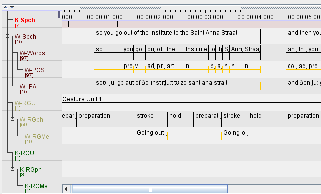
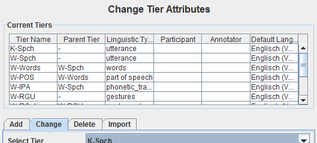

Elan's EAF
**********

Elan is a widely used transcription and annotation software developed at the
Max-Planck-Institute in Nijmegen. Due to its popularity the file format used
by Elan, an XML format called "EAF" ("Elan Annotation Standard"), has become
the de facto standard in language documentation and is used by several project
in qualitative and quantitative language typology. Poio API fully supports to
convert EAF files to GrAF annotation graphs and back again without any loss of
information.

Basically, Poio API extracts all `<annotation>` tags from the EAF file and
converts them to GrAF nodes and annotations. The `<time_slot>` tags in the
EAF file are used to create the regions for the nodes in GrAF. The rest of the
EAF file is left intact and stored as a separate file `prefix-extinfo.xml` in
parallel to the other GrAF files as described in section :ref:`graf_structure`
(where `prefix` is again the base name of the header file of GrAF).

The structure of the GrAF files is defined by the tier hierarchy in the Elan
file. As an example we will use the example data file that you may `download
from the the Elan website <http://tla.mpi.nl/tools/tla-tools/elan/download/>`_
(next to "Example Set"). If you open those files in Elan and sort the tiers by
hierarchy you will have the following tier hierarchy:

In this case, there are four *root tiers* with annotations: `K-Spch`, `W-Spch`,
`W-RGU` and `K-RGU`. The latter three each has several child tiers. Each tier
has a *linguistic type*, which you can see if you click on `Tier` -> `Change
Tier Attributes...`:

In this case the tier `K-Spch` has the linguistic type `utterance`, and so on.
These linguistic types correspond to the names in the data structure types of
Poio API (see section :ref:`data_structure_types`). Which means that if you
transform an EAF file into GrAF files with Poio API it will create one file for
each of the linguistic types. Each of those files file will contain all the
annotations of all the tiers that have the corresponding linguistic type. In
our example, Poio API will create one file `prefix-utterance.xml` that contain
the annotations from the tiers `K-Spch` and `W-Spch`. The file
`prefix-words.xml` will then contain all annotations from tier `W-Words` with
links to the parent annotations in `prefix-utterance.xml`. You can find an
example of the GrAF structure for the sample EAF file `on Github
<https://github.com/cidles/poio-api/tree/master/src/poioapi/tests/sample_files/elan_graf>`_.

The first annotation of the tier `W-Spch` with the annotation value
"so you go out of the Institute to the Saint Anna Straat." looks like this in
GrAF:

.. code-block:: xml

  <node xml:id="utterance..W-Spch..na8">
    <link targets="utterance..W-Spch..ra8"/>
  </node>
  <region anchors="780 4090" xml:id="utterance..W-Spch..ra8"/>
  <a as="utterance" label="utterance" ref="utterance..W-Spch..na8" xml:id="a8">
    <fs>
      <f name="annotation_value">so you go out of the Institute to the Saint Anna Straat.</f>
    </fs>
  </a>

The `<node>` is linked to a `<region>` that contains the values of the time slots of
the original EAF file. The annotation `<a>` for the node has a feature structure
`<fs>` with one features `<f>` for the annotation value.

The first annotation of `W-Spch` in `prefix-words.xml` looks like this:

.. code-block:: xml

  <node xml:id="words..W-Words..na23">
    <link targets="words..W-Words..ra23"/>
  </node>
  <region anchors="780 1340" xml:id="words..W-Words..ra23"/>
  <edge from="utterance..W-Spch..na8" to="words..W-Words..na23" xml:id="ea23"/>
  <a as="words" label="words" ref="words..W-Words..na23" xml:id="a23">
    <fs>
      <f name="annotation_value">so</f>
    </fs>
  </a>

The node for the word annotation is similar to the utterance node, except for an
additional `<edge>` tag that links the node to the corresponding utterance node.
Nodes like this are created for alle the annotations in the EAF file. When the
original annotation does not link to the video or audio file via a timeslot, for
example because it is on a tier with a linguistic type that has the stereotype
`Time Subdivision`, then no region and no link will be created for the node in
GrAF. As an example, here is the POS annotation that is linked to a word node
via an edge:

.. code-block:: xml

  <node xml:id="part_of_speech..W-POS..na121"/>
  <edge from="words..W-Words..na24" to="part_of_speech..W-POS..na121" xml:id="ea121"/>
  <a as="part_of_speech" label="part_of_speech" ref="part_of_speech..W-POS..na121" xml:id="a121">
    <fs>
      <f name="annotation_value">pro</f>
    </fs>
  </a>

**References:**
  * EAF Format: http://www.mpi.nl/tools/elan/EAF_Annotation_Format.pdf
  * Information about Elan: http://tla.mpi.nl/tools/tla-tools/elan/elan-description/
  * Elan Tools and Documentation: http://tla.mpi.nl/tools/tla-tools/elan/download/
