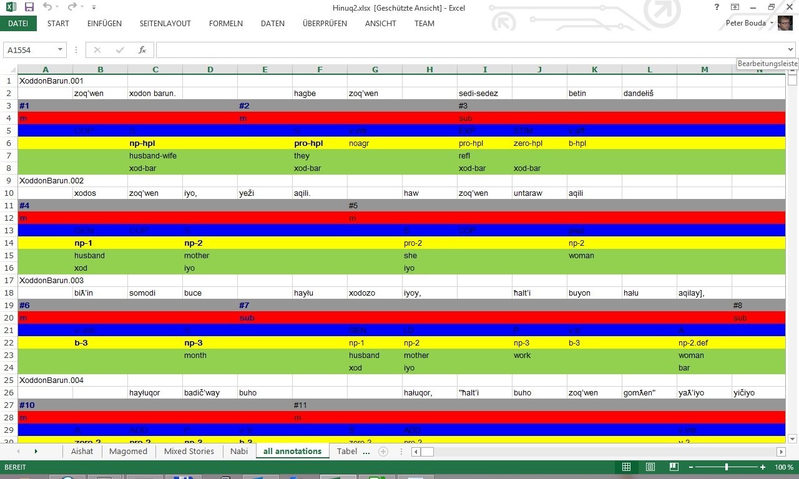
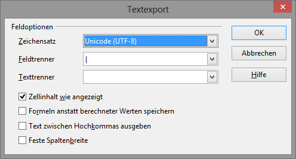

.. _excel_parser:

Spreadsheet to GrAF conversion
==============================

The section :ref:`parserwriter_howto` described how the general conversion
mechanism works in Poio API, and how you can implement your own parser to
convert a custom file format to a GrAF object. In this section we will continue
with a more complex example based on annotations in Microsoft Excel or
LibreOffice/OpenOffice Calc. We will show how can export Excel data into a
CSV file and discuss a CSV parser that we will finally use to convert the
Excel annotations into GrAF-XML files.

The data in this section comes from real-world language documentation project
about north-east caucasian languages. We will use several annotated texts in
the language Hinuq. The Excel file was kindly provided by Diana Forker.

The data in Excel
-----------------

The data in Excel consists of several "tiers" that were encoded as rows in an
Excel worksheet. For each utterance of the original text there are eight rows
in the Excel sheet. Here is a screenshot of Excel with that shows the first
three utterances:

The first row, for example, contains a unique ID, while the second row
consists of the tokenized utterance ("word" tier), with optional spaces
between them. Row three and four contain an ID and an annotation for the
so-called "clause unit", a term stemming from the annotation framework GRAID
(Grammatical Relations and Animacy in Discourse), developed by Geoffrey Haig
and Stefan Schnell. The subsequent four rows contain GRAID annotations, custom
annotations and translations based on the word tier.

In this case Diana was interested in the different word orders that were used
in the Hinuq texts. Word order appear within the "clause units", as those
represent parts of utterances like main clauses and sub clauses. To analyze the
word order now, the interesting units within the clause units are the
participants and the verb. Participants of clauses are normally encoded
regarding the syntactic/semantic role within the clause, Diana used the labels
`S`, `A` and `P` that are widely used within general linguistics and language
typology. The verbs have different tags like 'v.tr', 'v.intr' or 'v.aff'. All
the interesting tags appear in row five in Excel. Because we are only interested
in clause units and the tags that represent participant and verbs within each
clause unit, our parser will only return informations from row three, four and
five of each utterance. It should be easy enough to extend the parser to more
rows later. The names that those three rows will be `clause_id`, `clause_type`
and `grammatical_relation`, containing the IDs of the clause units, the type of
the clauses (main or sub class) and the grammatical relations as discussed,
respectively. These are the *tiers* that our parser will process and for which
it will return the annotations from the Excel CSV file.

Export the data
---------------

The first step is to export the data from Excel to a CSV file. CSV files are
much easier to read in with Python. Unfortunately, Microsoft Excel still has
a big problem when it comes to export Unicode CSV files. In the case of the
Hinuq data, Diana used a lot of different Unicode characters that we need
to preserve when exporting. We thus used Open Office to export the data to
a CSV file that uses a UTF-8 encoding. You can open your Excel file in Open
Office, click on `File` -> `Save As` and then choose `Text CSV` as file format.
In the following dialog choose `UTF-8` as encoding and the pipe symbol "|" as
field seperator. We also chose an empty string as text seperator:

In the following steps we assume that the filename is `Hinuq.csv` and that
the file was saved with those settings.

The implementation of the parser
--------------------------------

The easiest way to implement a parser for Poio API is to sub-class from
:py:class:`poioapi.io.graf.BaseParser` as described in section
:ref:`parserwriter_howto`. We have to implement six abstract methods so
that the :py:class:`poioapi.io.graf.GrAFConverter` class can then build a GrAF
from the CSV data. The six methods are:

* get_root_tiers() - Get the root tiers.
* get_child_tiers_for_tier(tier) - Get the child tiers of a give tier.
* get_annotations_for_tier(tier, annotation_parent) - Get the annotations on a
  given tier.
* tier_has_regions(tier) - Check if the annotations on a given tier specify
  regions.
* region_for_annotation(annotation) - Get the region for a given annotation.
* get_primary_data() - Get the primary data that the annotations refer to.

First, we will implement the constructor of our new parser class
``ExcelParser``. The constructor does most of the work in our class, as it is
responsible to parse the CSV file and put all the interesting information
in Python data structures. This is possible here, because the CSV file does
not contain so much data and we can still store everything in memory. If your
data is too big you may implement a more sophisticated method to stream the
data while the converter is calling the methods. Our full constructor looks
like this:

.. code-block:: python

    import csv
    import codecs

    import poioapi.io.graf
    import poioapi.annotationgraph
    import poioapi.data

    class ExcelParser(poioapi.io.graf.BaseParser):

        def __init__(self, filepath):
            self.word_orders = dict()
            self.clauses = list()
            self.clause_types = dict()
            self.last_id = -1
            with codecs.open(filepath, "r", "utf-8") as csvfile:
                hinuq2 = csv.reader(csvfile, delimiter='|')
                i = 0
                for row in hinuq2:
                    if i == 2:
                        clause_ids = row
                    elif i == 3:
                        clause_types = row
                    elif i == 4:
                        grammatical_relations = row
                    i += 1  
                    if i > 7:
                        # now parse
                        word_order = []
                        c_id = None
                        prev_c_id = None
                        for j, clause_id in enumerate(clause_ids):

                            # new clause
                            if clause_id != "":
                                # add word order to previous clause
                                if len(word_order) > 0:
                                    self.word_orders[c_id] = word_order
                                word_order = []
                                
                                # add new clause
                                c_id = self._next_id()
                                self.clauses.append(c_id)
                                self.clause_types[c_id] = clause_types[j].strip()
                            
                            grammatical_relation = grammatical_relations[j].strip()
                            word_order.append(grammatical_relation)

                        if len(word_order) > 0:
                            self.word_orders[c_id] = word_order
                        i = 0

The important data structures here are the three properties `self.clauses`,
`self.clause_types` and `self.word_orders`. The first is a list of IDs,
while the latter two a dictionaries with the clause IDs as keys. The store
the annotations (clause type and grammatical relations from row four and five
of the Excel file) for each clause unit as values.

The six abstract methods of the base class are then easy to implement, we will
just list them as a big block of code here:

.. code-block:: python

    def _next_id(self):
        self.last_id += 1
        return self.last_id

    def get_root_tiers(self):
        return [poioapi.io.graf.Tier("clause_id")]

    def get_child_tiers_for_tier(self, tier):
        if tier.name == "clause_id":
            return [poioapi.io.graf.Tier("grammatical_relation"),
                    poioapi.io.graf.Tier("clause_type")]

        return None

    def get_annotations_for_tier(self, tier, annotation_parent=None):
        if tier.name == "clause_id":
            return [poioapi.io.graf.Annotation(i, v)
                for i, v in enumerate(self.clauses)]

        elif tier.name == "clause_type":
            return [poioapi.io.graf.Annotation(
                self._next_id(), self.clause_types[annotation_parent.id])]

        elif tier.name == "grammatical_relation":
            return [poioapi.io.graf.Annotation(self._next_id(), v) 
                for v in self.word_orders[annotation_parent.id]]
        
        return []

    def tier_has_regions(self, tier):
        return False

    def region_for_annotation(self, annotation):
        pass

    def get_primary_data(self):
        pass

The tier hierarchy is simple, we have the root tier `clause_id` and two child
tiers `grammatical_relation` and `clause_type`. The two methods
``get_root_tiers()`` and ``get_child_tiers_of_tier()`` implement this hierarchy.
The next method ``get_annotations_for_tier()`` returns the contents of the
different tiers as ``Annotation`` objects. We just have to make sure that all
the IDs are unique, which is the responsibilty of the method ``_next_id()``.
The last three methods can stay empty, as there are no regions on any tier and
did not access the primary data in the Excel file. Based on this parser class
we can now write a simple converter for our type of CSV files, as demonstrated
in the next section.

How to use the parser to convert to GrAF-XML
--------------------------------------------

Next we want to implement a helper function that creates an ``AnnotationGraph``
object from an Excel file, which we will then use to analyze the word orders in
the Hinuq texts. We can simply create a parser object from our new class
``ExcelParser`` and pass it to the :py:class:`poioapi.io.graf.GrAFConverter`
class. After parsing, we have access to the GrAF object and the tier hierarchy
through the converter object. We need to copy these objects into the
``AnnotationGraph`` object to be ableto use some of the methods of the
``AnnotationGraph`` later when we analyze the word order. The full code of our
helper method is:

.. code-block:: python

    def from_excel(filepath):
        ag = poioapi.annotationgraph.AnnotationGraph()
        parser = ExcelParser(filepath)
        converter = poioapi.io.graf.GrAFConverter(parser)
        converter.parse()
        ag.tier_hierarchies = converter.tier_hierarchies
        ag.structure_type_handler = poioapi.data.DataStructureType(
            ag.tier_hierarchies[0])
        ag.graf = converter.graf
        return ag

With this preparation we can now follow up with the analysis of word order in
the Excel file. This analysis is part of a separate `IPython notebook
<http://ipython.org/notebook.html>`_ that you can view and download here:

http://nbviewer.ipython.org/urls/raw.github.com/pbouda/notebooks/master/Diana%20Hinuq%20Word%20Order.ipynb

The first block of code in the notebook loads a file `helper/diana.py`, which
contains exactly the class ``ExcelParser`` and the helper function
``from_excel()`` from above. You can download the helper file here:

https://raw.github.com/pbouda/notebooks/master/helpers/diana.py
