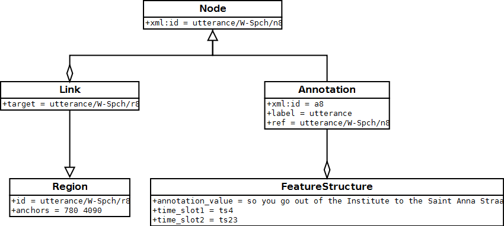

Introduction to Poio API
************************

Poio API is a free and open source Python library to access and search data
from language documentation in your linguistic analysis workflow. It converts
file formats like Elan's EAF, Toolbox files, Typecraft XML and others into
annotation graphs as defined in ISO 24612. Those graphs, for which we use
an implementation called "Graph Annotation Framework" (GrAF), allow unified
access to linguistic data from a wide range sources.

Think of GrAF as an assembly language for linguistic annotation, then Poio API
is a libray to map from and to higher-level languages.

Poio API is developed as a part of the `curation project of the F-AG 3 within
CLARIN-D <http://de.clarin.eu/en/discipline-specific-working-groups/wg-3-linguistic-fieldwork-anthropology-language-typology/curation-project-1.html>`_.

**References:**
  * ISO 24612: http://www.iso.org/iso/catalogue_detail.htm?csnumber=37326
  * Graph Annotation Framework (GrAF): http://www.xces.org/ns/GrAF/1.0/

Quick Example
=============

This block of code loads a Elan EAF file as annotation graph and writes the data
as html table into a file:

.. code-block:: python

  # imports
  import poioapi.annotationgraph
  import poioapi.data

  # Create an empty annotation graph
  ag = poioapi.annotationgraph.AnnotationGraph(None)
  # Load the data from EAF file
  ag.from_elan("elan-example3.eaf")
  # Set the structure type for hierarchical/interlinear output
  ag.structure_type_handler = poioapi.data.DataStructureType(
      ag.tier_hierarchies[0])

  # Output as html
  import codecs
  f = codecs.open("example.html", "w", "utf-8")
  f.write(ag.as_html_table(False, True))
  f.close()

To try it out you may download the `example file from the Elan homepage
<http://tla.mpi.nl/tools/tla-tools/elan/download/>`_.

.. _data_structure_types:

Data Structure Types
====================

We use a data type called `DataStructureType` to represent annotation schemes
in a tree. A simple data structure type describing that the researcher wants to
tokenize a text into words before adding a word-for-word translation and a
translation for the whole utterance looks like this:

.. code-block:: python

	[ 'utterance', [ 'word', 'wfw' ], 'translation' ]

A slightly more complex annotation schema is GRAID (Grammatical Relations and
Animacy in Discourse), developed by Geoffrey Haig and Stefan Schnell. GRAID adds
the notion of clause units as an intermediate layer between utterance and word
and three more annotation tiers on different levels:

.. code-block:: python

	[ 'utterance',
		[ 'clause unit',
			[ 'word', 'wfw', 'graid1' ],
		'graid2' ],
	  'translation', 'comment' ]

One advantage in representing annotation schemes through those simple trees, is
that the linguists instantly understand how such a tree works and can give a
representation of "their" annotation schema. In language documentation and
general linguistics researchers tend to create ad-hoc annotation schemes fitting
their background and then normally start to create only those annotations
related to their current research project. This is for example reflected in an
annotation software like ELAN, where the user can freely create tiers with any
names and arrange them in custom hierarchies. As we need to map those data into
our internal representation, we try to ease the creation of custom annotation
schemes that are easy to understand for users. For this we will allow users to
create their own data structure types and derive the annotation schemes for
GrAF files from those structures.

In Poio API there are several data structure types pre-defined as classes in
the module `poioapi.data`, for example:

* :py:class:`poioapi.data.DataStructureTypeGraid`
* :py:class:`poioapi.data.DataStructureTypeMorphsynt`

The user of the API can of course create her own fixed data structure type, by
deriving a custom class from the base class `poioapi.data.DataStructureType`.
In you workflow you might also create an object with your own tier hierarchy
by passing a list of lists (as in the examples above) when creating an object
from `DataStructureType`:

.. code-block:: python

  import poioapi.data

  my_data_structure = poioapi.data.DataStructureType(
      [ 'utterance', [ 'word', 'wfw' ], 'translation' ])

If you create an annotation graph from one of the supported file formats, the
hierarchies that are present in file are accesible via the `tier_hierarchies`
property of the annotation graph object. As an example, we use the `example
file from the Elan homepage
<http://tla.mpi.nl/tools/tla-tools/elan/download/>`_:

.. code-block:: python

  import poioapi.annotationgraph

  ag = poioapi.annotationgraph.AnnotationGraph()
  ag.from_elan("elan-example3.eaf")
  print(ag.tier_hierarchies)

Which will output:

.. code-block:: python

  [

    ['utterance..K-Spch'],

    ['utterance..W-Spch',
      ['words..W-Words',
        ['part_of_speech..W-POS']
      ],
      ['phonetic_transcription..W-IPA']
    ],

    ['gestures..W-RGU',
      ['gesture_phases..W-RGph',
        ['gesture_meaning..W-RGMe']
      ]
    ],

    ['gestures..K-RGU',
      ['gesture_phases..K-RGph',
        ['gesture_meaning..K-RGMe']
      ]
    ]

  ]

This is a list of tier hierarchies. In this case, there are four hierarchies in
the .eaf file: two for each speaker, where one has the root tier with
utterances (`utterance..K-Spch` and `utterance..K-Spch`), the other one with
the root tier for gestures (`gestures..W-RGU` and `gestures..K-RGU`)

The user can now easily create an instance of the class `DataStructureType`
with one of the hierarchies. This will then be the default hierarchy for all
subsequent actions on the annotation graph (e.g. queries, HTML output, etc.):

.. code-block:: python

  ag.structure_type_handler = poioapi.data.DataStructureType(
      ag.tier_hierarchies[0])

.. _graf_structure:

Structure of GrAF graphs in Poio API
====================================

To represent data from tier-based annotations, Poio API internally uses the
library `graf-python <http://media.cidles.eu/poio/graf-pthon>`_ to store
data and annotations. Those data structures conform to the so-called GrAF
standard and consist of **nodes** and **edges* enriched by **feature
structures** that contain the linguistic annotations. The nodes itself are
**linked** to the primary data (text, audio, video, ...) via **regions**. The
following schema pictures the content of one node:

Edges are then simple connections between individual nodes that can also have
an `Annotation` with the same feature structures as the nodes.

Poio API only uses a subset of all possible GrAF graphs to represent tier-based
annotations. That means that Poio API will automatically only create certain
edges between nodes and their annotations, to represent a parent-children
relationship between annotations that are on different tiers in the
original annotation file. Poio API will not create any additional edges between
annotations on one single tier and between annotations of tiers that are
not parent or child of each other. In addition to this, Poio API will also
create some fixed feature structures from the content of annotations when you
load a file. A standard string annotation (i.e. the part-of-speech tag in a
Typecraft XML file) is stored as feature `annotation_value` in a node. See
section :ref:`graf_structure_elan` for an in-depth description of such a GrAF
structure when you load an Elan EAF file.

You, as a user, are of course free to create any edges or add any feature
structures and features when you process the graphs in your worklow. You have
access to the GrAF object in Poio API after you loaded the content of a file
into an object of the class ``AnnotationGraph``. The GrAF object is stored in
the property `graf`:

  # imports
  import poioapi.annotationgraph
  import poioapi.data

  # Create an empty annotation graph
  ag = poioapi.annotationgraph.AnnotationGraph(None)
  # Load the data from EAF file
  ag.from_elan("elan-example3.eaf")

  my_graf_object = ag.graf

  # ... then do something with the GrAF object...

Keep in mind that probably none of your custom changes might be saved to some
of the supoprted output file formats like Elan EAF or Typecraft XML. If you
want to make sure that all your data persists when reading and writing files
you should store the graphs as GrAF-XML, which will contain all information
in the GrAF object:

.. code-block:: python

  # ... you did something with ag.graf ...

  # save it
  ag.to_graf("my_graf_object.hdr")

  # load agian
  ag.from_graf("my_graf_object.hdr")

Other file formats might only store a subset of the content of `ag.graf`.

.. _graf_structure_elan:

Example: GrAF from an Elan EAF file
===================================

Elan is a widely used transcription and annotation software developed at the
Max-Planck-Institute in Nijmegen. Due to its popularity the file format used
by Elan, an XML format called "EAF" ("Elan Annotation Standard"), has become
the de facto standard in language documentation and is used by several project
in qualitative and quantitative language typology. Poio API fully supports to
convert EAF files to GrAF annotation graphs and back again without any loss of
information.

Basically, Poio API extracts all `<annotation>` tags from the EAF file and
converts them to GrAF nodes and annotations. The `<time_slot>` tags in the
EAF file are used to create the regions for the nodes in GrAF. The rest of the
EAF file is left intact and stored as a separate file `prefix-extinfo.xml` in
parallel to the other GrAF files as described in section :ref:`graf_structure`
(where `prefix` is again the base name of the header file of GrAF).

The structure of the GrAF files is defined by the tier hierarchy in the Elan
file. As an example we will use the example data file that you may `download
from the the Elan website <http://tla.mpi.nl/tools/tla-tools/elan/download/>`_
(next to "Example Set"). If you open those files in Elan and sort the tiers by
hierarchy you will have the following tier hierarchy:

.. image:: _static/elan_tier_hierarchy.png

In this case, there are four *root tiers* with annotations: `K-Spch`, `W-Spch`,
`W-RGU` and `K-RGU`. The latter three each has several child tiers. Each tier
has a *linguistic type*, which you can see if you click on `Tier` -> `Change
Tier Attributes...`:

.. image:: _static/elan_tier_attributes.png

In this case the tier `K-Spch` has the linguistic type `utterance`, and so on.
These linguistic types correspond to the names in the data structure types of
Poio API (see section :ref:`data_structure_types`). Which means that if you
transform an EAF file into GrAF files with Poio API it will create one file for
each of the linguistic types. Each of those files file will contain all the
annotations of all the tiers that have the corresponding linguistic type. In
our example, Poio API will create one file `prefix-utterance.xml` that contain
the annotations from the tiers `K-Spch` and `W-Spch`. The file
`prefix-words.xml` will then contain all annotations from tier `W-Words` with
links to the parent annotations in `prefix-utterance.xml`. You can find an
example of the GrAF structure for the sample EAF file `on Github
<https://github.com/cidles/poio-api/tree/master/src/poioapi/tests/sample_files/elan_graf>`_.

The first annotation of the tier `W-Spch` with the annotation value
"so you go out of the Institute to the Saint Anna Straat." looks like this in
GrAF:

.. code-block:: xml

  <node xml:id="utterance..W-Spch..na8">
    <link targets="utterance..W-Spch..ra8"/>
  </node>
  <region anchors="780 4090" xml:id="utterance..W-Spch..ra8"/>
  <a as="utterance" label="utterance" ref="utterance..W-Spch..na8" xml:id="a8">
    <fs>
      <f name="annotation_value">so you go out of the Institute to the Saint Anna Straat.</f>
    </fs>
  </a>

The `<node>` is linked to a `<region>` that contains the values of the time slots of
the original EAF file. The annotation `<a>` for the node has a feature structure
`<fs>` with one features `<f>` for the annotation value.

The first annotation of `W-Spch` in `prefix-words.xml` looks like this:

.. code-block:: xml

  <node xml:id="words..W-Words..na23">
    <link targets="words..W-Words..ra23"/>
  </node>
  <region anchors="780 1340" xml:id="words..W-Words..ra23"/>
  <edge from="utterance..W-Spch..na8" to="words..W-Words..na23" xml:id="ea23"/>
  <a as="words" label="words" ref="words..W-Words..na23" xml:id="a23">
    <fs>
      <f name="annotation_value">so</f>
    </fs>
  </a>

The node for the word annotation is similar to the utterance node, except for an
additional `<edge>` tag that links the node to the corresponding utterance node.
Nodes like this are created for alle the annotations in the EAF file. When the
original annotation does not link to the video or audio file via a timeslot, for
example because it is on a tier with a linguistic type that has the stereotype
`Time Subdivision`, then no region and no link will be created for the node in
GrAF. As an example, here is the POS annotation that is linked to a word node
via an edge:

.. code-block:: xml

  <node xml:id="part_of_speech..W-POS..na121"/>
  <edge from="words..W-Words..na24" to="part_of_speech..W-POS..na121" xml:id="ea121"/>
  <a as="part_of_speech" label="part_of_speech" ref="part_of_speech..W-POS..na121" xml:id="a121">
    <fs>
      <f name="annotation_value">pro</f>
    </fs>
  </a>

**References:**
  * EAF Format: http://www.mpi.nl/tools/elan/EAF_Annotation_Format.pdf
  * Information about Elan: http://tla.mpi.nl/tools/tla-tools/elan/elan-description/
  * Elan Tools and Documentation: http://tla.mpi.nl/tools/tla-tools/elan/download/
